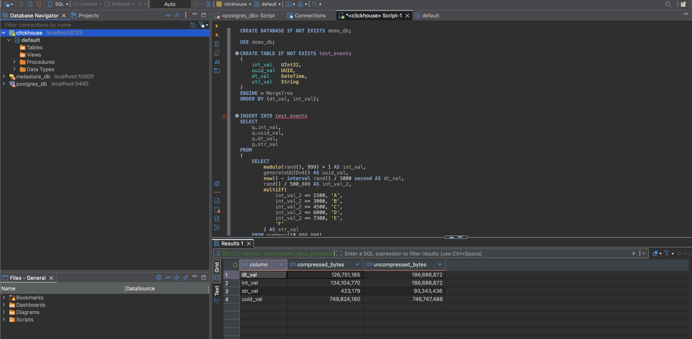

## TASK 4
```
   ┌─str_val─┬─total_rows─┬─uniq_users─┐
1. │ B       │    1747440 │    1758122 │
2. │ C       │    1746624 │    1743755 │
3. │ D       │    1746072 │    1738321 │
4. │ A       │    1744928 │    1750076 │
5. │ E       │    1512932 │    1510460 │
6. │ F       │    1502004 │    1510773 │
   └─────────┴────────────┴────────────┘

6 rows in set. Elapsed: 0.114 sec. Processed 10.00 million rows, 250.00 MB (87.39 million rows/s., 2.18 GB/s.)
Peak memory usage: 28.25 MiB.

```


## TASK 8

* Таблица: `test_events`
* Размер на диске (сжатый): 215,497,212 bytes (~215 МБ)
* Размер на диске (несжатый): 330,000,000 bytes (~330 МБ)
* Размер первичного индекса: 4,904 bytes (~4.9 КБ)


* **dt_val**

  * Размер сжатый: 25,677,712 bytes (~25.7 МБ)
  * Размер несжатый: 40,000,000 bytes (~40 МБ)

* **int_val**

  * Размер сжатый: 28,729,725 bytes (~28.7 МБ)
  * Размер несжатый: 40,000,000 bytes (~40 МБ)

* **str_val**

  * Размер сжатый: 406,052 bytes (~0.4 МБ)
  * Размер несжатый: 90,000,000 bytes (~90 МБ)

* **uuid_val**

  * Размер сжатый: 160,659,216 bytes (~160.6 МБ)
  * Размер несжатый: 160,000,000 bytes (~160 МБ)

* Пример аналитического запроса: `SELECT str_val, count(), uniq(uuid_val) FROM test_events GROUP BY str_val`
* Время выполнения: 113 ms
* Память, использованная запросом: 29,618,587 bytes (~28 МБ)

