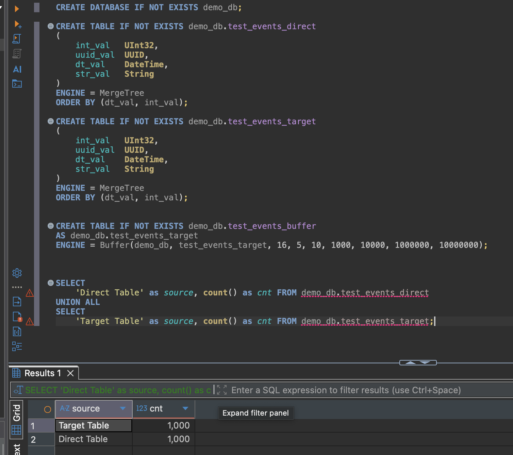
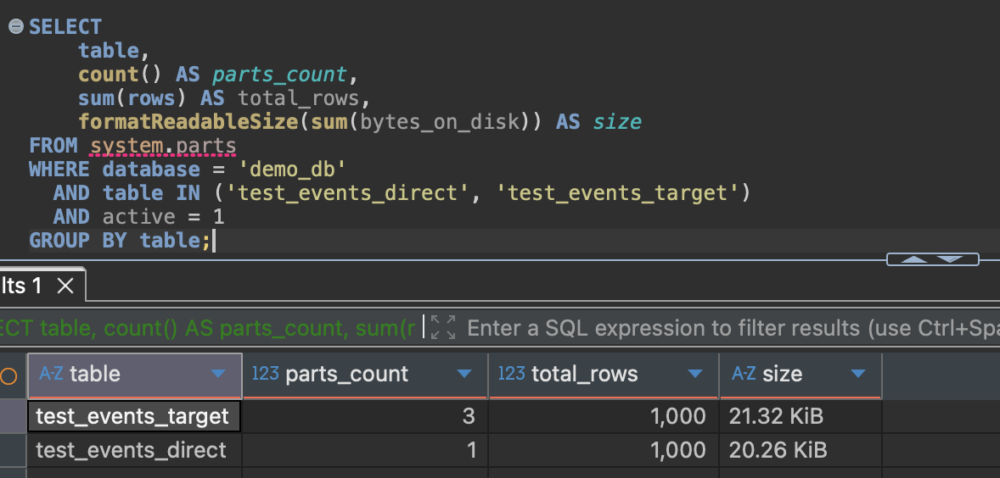

Для вставки использовались команды
```
(for i in {1..1000}; do clickhouse-client -q "INSERT INTO demo_db.test_events_direct VALUES ($i, generateUUIDv4(), now(), 'direct')"; done)
```
и
```
(for i in {1..1000}; do clickhouse-client -q "INSERT INTO demo_db.test_events_buffer VALUES ($i, generateUUIDv4(), now(), 'buffer')"; done) 
```



